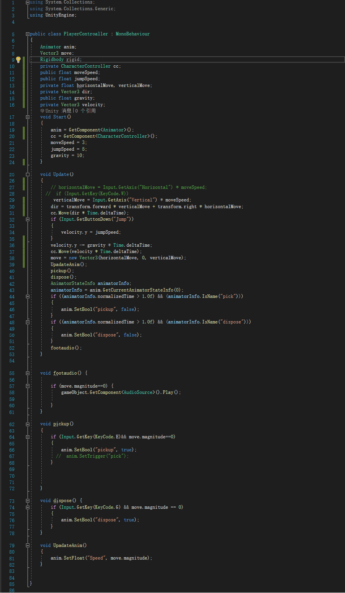
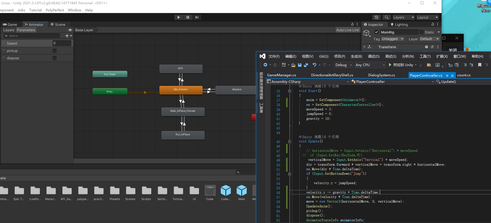
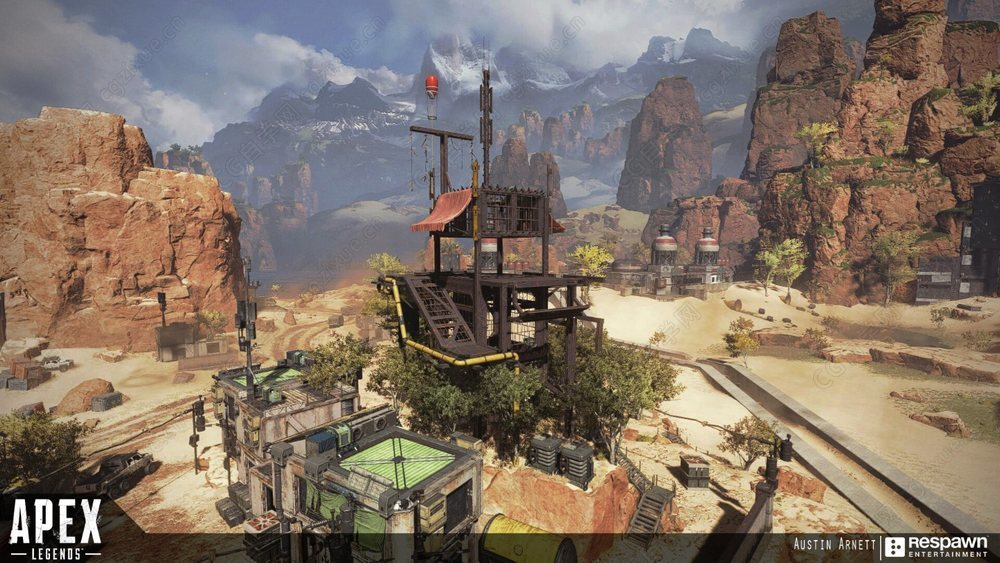
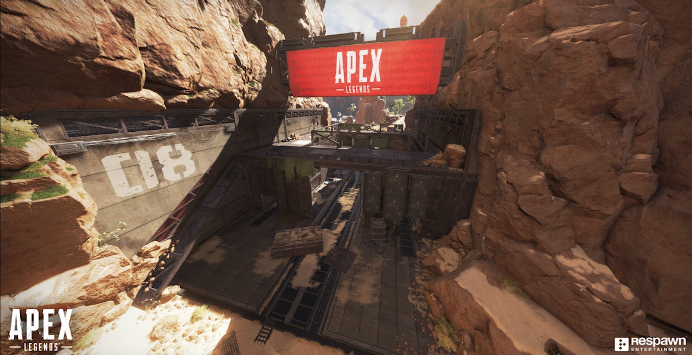
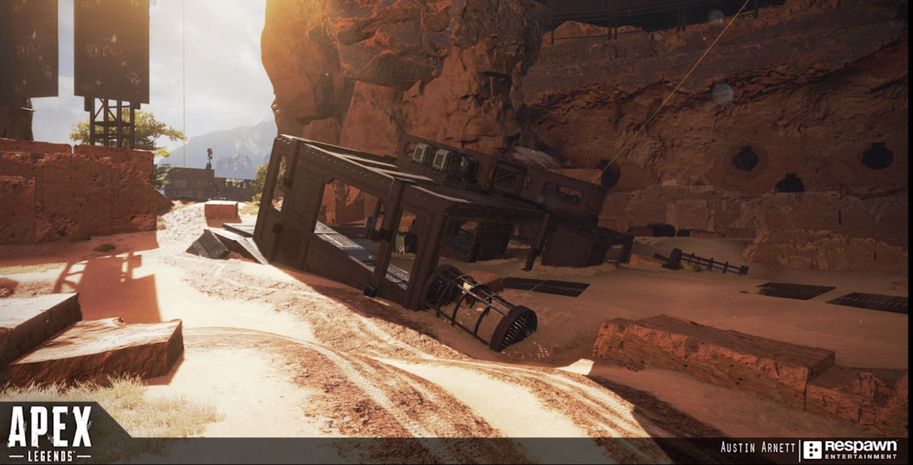

# Report
---
## Introduction
There is a first-person perspective to control the characters，and scenes contained tables, flames, and flowers.   And a click to start the game, automatically generate 9 cans, pick up the cans on the ground, from the second floor windowsill drop the second floor within the specified area, score 2 points is a successful challenge.

## Project Plan

## Design

First of all, a cartoon-like scene was built using the material model package, and a two-story building was built and made to look very warm.  It is equipped with tables, chairs, kitchens, refrigerators, stoves, flowers, and other decorative items.  Make the scene look comfortable.

## Technical Element

URP performs a single pass forward rendering using a live shadow light and light blanking for each object.  In contrast, a traditional pipeline for forward rendering performs an additional traversal for each pixel of light in range.  This means that the URP will have fewer draw calls.  This feature is also supported by the shader Graphics tool, which provides additional benefits to the shader authoring workflow.  UPR can greatly reduce the consumption of light processing, and we can add some auxiliary light sources to improve the display quality in the high-mode hero display.

## Script

The script was used to detect the distance between the camera and the flower. The flower growth could be seen when it was close to the flower, while the flower would wither when it was far away. The flame made use of particle system and 3D sound effect to make the character hear the sound of the flame burning when it was close to the character. In the particle system, there are constant particle generation and particle extinction. Generally speaking, the particle extinction rate and generation rate are consistent (except the preheating stage), so that the particle system maintains a stable state. With the particle system, special effects such as fireworks, blisters, muzzle sparks and nuclear bombs can be achieved. Control the shape of the transmitter (cylindrical, conical, spherical, circular, etc.), emission period, particle number, particle preheating, emission delay, etc. Control particle shape, size, color, material, speed, rotation, life cycle, etc., and can modify these properties during the life cycle of the particle; Add a tailing effect to particles. Control multiple particle systems to emit particles in parallel or in serial. These can make the special effects of the scene more cool.

From the first-person perspective, I bound the camera to the head of the character, so that no matter walking, running, picking up or throwing, the animation played is in line with the real experience of the character, and the sound of the footsteps played along with the footsteps are in line with the real experience of the character.

## Unique Element

Flowers growing and dying, the effects and sounds of fire, the creation of cans.

## Summary

My scene demonstrates all the essential elements introduced throughout the labs, such as lighting, materials and textures, 3D physics, modelling, scripting, animation, sound and particle systems. To be honest, in my initial idea, the reference figure of the two-layer scene model is as follows. After careful consideration, I find that the style is too stiff and sci-fi, so replacing it with a warm scene will also make users feel comfortable.

## Future Work

Learn how to achieve the effects of pickup and parabolic throwing, button trigger events and physical rigidbody and animation control playback through online resources.

## link to GitHub repository

)

## References

Below are all the references used in my application and report.

### GitHub

GitHub homepage: https://github.com/glowkeeper/P3D

Application directory: https://github.com/glowkeeper/P3D/src/assignment

### Asset References

+ [Standard Assets](https://assetstore.unity.com/packages/essentials/asset-packs/standard-assets-for-unity-2018-4-32351)
+ [Free Shipping Containers](https://assetstore.unity.com/packages/3d/environments/industrial/free-shipping-containers-18315)
+ [Old USSR Lamp](https://assetstore.unity.com/packages/3d/props/electronics/old-ussr-lamp-110400)
+ [PBR LAMPS PACK](https://assetstore.unity.com/packages/3d/props/interior/free-pbr-lamps-70181)
+ [Ball Pack](https://assetstore.unity.com/packages/3d/props/ball-pack-446)

### Script References

...references to any scripts you've created.

### Report References

Peter Shirley, 2020, Ray Tracing in One Weekend, Diffuse Materials. Available at https://raytracing.github.io/books/RayTracingInOneWeekend.html#diffusematerials, Accessed October, 2020.
